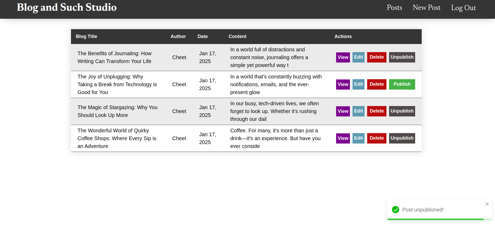
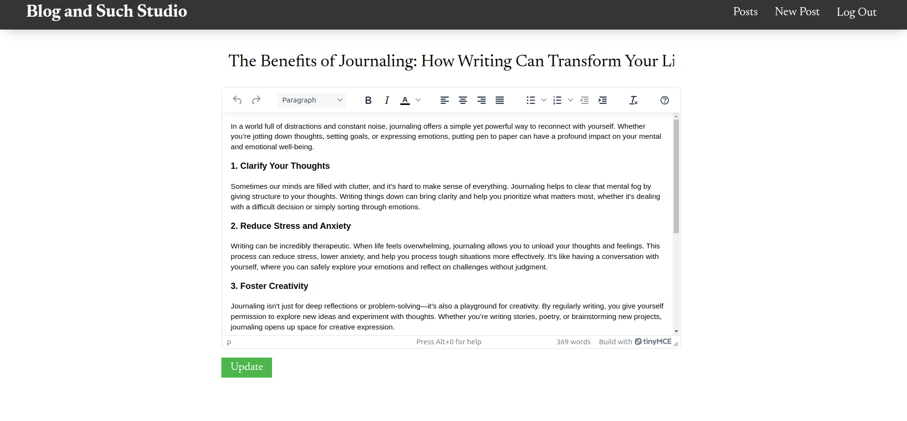
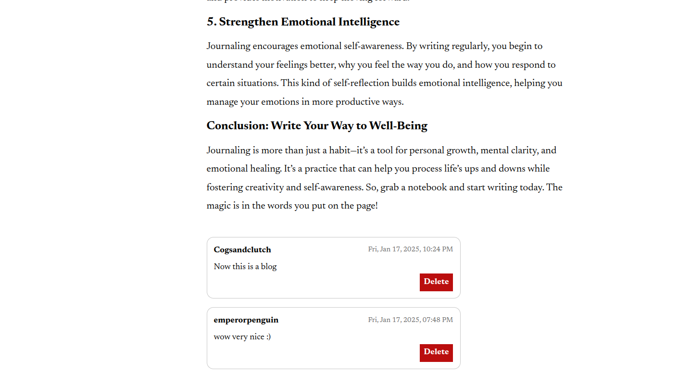

# Blog and Such 

This is the frontend CMS of my full stack blog app that uses React and Vite which is hosted on Netlify.

You can check it out here [Blog and Such Studio](https://blogandsuchstudio.netlify.app/)

The client frontend is also available at [Blog and Such](https://blogandsuch.netlify.app/)

Blog and Such API: https://github.com/ImmaCheetah/blog-api-backend

Client Repo: https://github.com/ImmaCheetah/blog-api-frontend

## Features
- CRUD operations
- Responsive UI
- Form validation on frontend and backend
- Toast notifications for actions
- TinyMCE text editor

## Tools/Languages
     
 

## Screenshots

## Learning Outcomes
- Use API to send and receive request
- Display data received from API
- Complete CRUD operations using API
- Implement rich text editor
- Parse rich text and display it correctly
